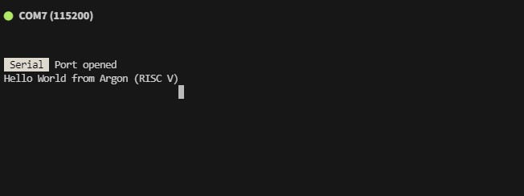
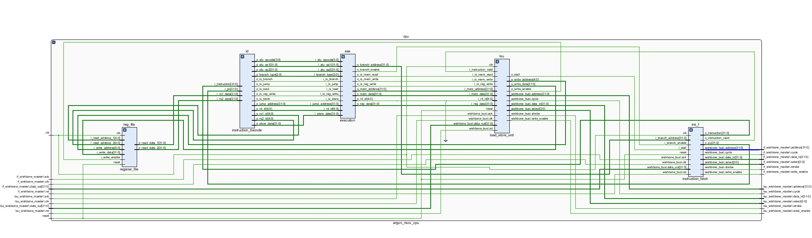
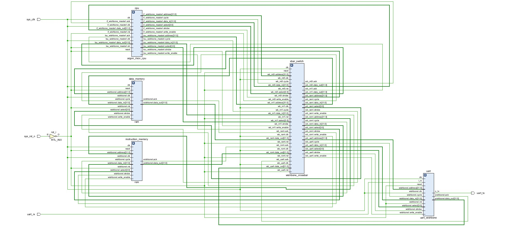

# Argon
RISC V CPU, This is a basic RV32I CPU implemented in SystemVerilog

## Introduction

Welcome to **Argon**, my hobbyist RISC-V CPU and SoC project. This is something I've built as a learning exercise in hardware design and SystemVerilog, so don’t expect it to compete with other RISC-V implementations. However, it might serve as an interesting reference for others who are new to hardware design and curious about how a beginner would approach building a CPU from scratch.

## Features

- **RV32I Base Instruction Set** (with plans to extend to RV32G over time)
- **Wishbone Bus** for memory and peripherals
- **Multicycle Design** (pipelining planned for future versions)
- **BRAM for RAM and ROM** (temporary solution until external memory is added)
- **Memory-Mapped UART** for communication with the outside world
- Synthesizable on **Xilinx FPGAs** (tested on Artix-7 and Zynq 7010)

## Why the name Argon?

I have a personal goal to run at least a "Hello, World!" application written in a language I created, compiled by a compiler I wrote, and running on a CPU I built. It feels like the ultimate nerd achievement! I’ve previously named some of my toy languages and compilers Potassium and Lithium, so I decided to stick with the element theme, and Argon seemed fitting.

## Status
The baisc CPU fully systhisises and works with IO only provided by the UART interface. You have no idea ho happy I was to see this screen :)

There is test benches for all the indvidual modules but no system wide test bench, I endded up debuggin that by inserting ILA all over the place. 
And because every one like picures here is some schamitics of the CPU and the SoC 

## Next Steps
- Some more experments with Software runnign on the CPU. 
- Pipeline. I plan to immplment that classic 5 stage pipeline for a simmple CPU. Well maybe 4 stages, as currently I have the Memeory load store and Writeback in one stage. 
- Add the more RISC V extentions (likley in this order). 
    - Zicsr
    - M
    - D
    - F 
    - A 
    - C 
- Add more memeory mapped peripherals (SD Card, GIO, Ethernet, Timers) 
- Use External DDR3 Ram
- Replace Wishbone bus with AXI so I can use more of the built in IP :) 

## Conclusion
I hope this project proves useful to anyone who stumbles upon it. I’ll keep updating it, and maybe I’ll write up an article on my learning process along the way (no promises, though!). Stay tuned!
---